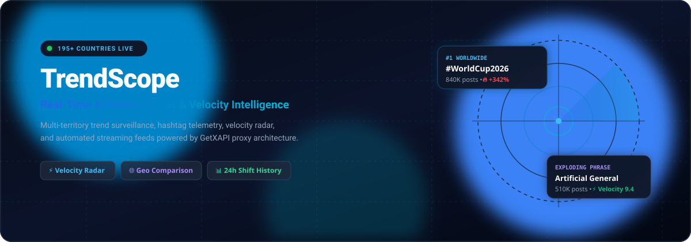
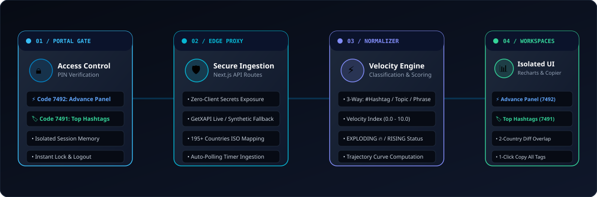

# TrendScope — X/Twitter Trends Intelligence Dashboard

<div align="center">
  
</div>

<p align="center">
  <strong>Surveil, quantify, and compare viral momentum across X (Twitter) in real-time across 195+ countries and worldwide territories.</strong>
</p>

<p align="center">
  <a href="https://vercel.com/new"></a>
  
  
  
  
</p>

---

## ⚡ Animated Architecture & Telemetry Pipeline

<div align="center">
  
</div>

---

## 🎯 Key Functional Capabilities

```
┌─────────────────────────┬────────────────────────────────────────────────────────┐
│ Module                  │ Highlights                                             │
├─────────────────────────┼────────────────────────────────────────────────────────┤
│ 🌐 Global Surveillance  │ 195+ ISO country selection with worldwide aggregates   │
│ 🏷️ 3-Way Classification │ Live segmenting: # Hashtags, Topics, and Phrases       │
│ 🚀 Velocity Radar       │ Real-time momentum scoring (0-10) with Exploding tags  │
│ ⚔️ Geo Comparison Diff  │ Side-by-side overlap, shared hashtags, and volume gaps │
│ 📈 24h Shift History    │ Ranking trajectory curves and volume change trackers   │
│ 🛡️ Secure Edge Proxy    │ Zero-client API secrets with custom GetXAPI key support│
│ 🔄 Polling Engine       │ Dynamic intervals (15s, 30s, 60s, 5m) with Master PIN  │
│ 🧪 Zero-Config Demo     │ Instant high-fidelity synthetic feeds without API keys │
└─────────────────────────┴────────────────────────────────────────────────────────┘
```

---

## 🏗️ System Workflow Architecture

```
[ User Browser / Client View ]
         │
         ▼  (1) Selects ISO Territory & Custom Polling Interval
[ Secure Server API Proxy: /api/trends ]
         │
         ├───► Has Custom Key? ────────┐
         │                             ▼
         │                 [ Call GetXAPI Edge Endpoint ]
         │                             │
         ▼ (Fallback)                  ▼
[ Synthetic Geo Engine ] ◄─── [ Raw JSON Trend Data ]
         │
         ▼
[ Normalizer & Velocity Telemetry Engine ]
  ├─ Detect type: Hashtag (#), Phrase (multi-word), Topic (entity)
  ├─ Compute Velocity Index (0.0 – 10.0)
  └─ Classify Status: EXPLODING 🔥 | RISING 📈 | STABLE ➖ | FALLING 📉
         │
         ▼
[ Recharts / Responsive Table / Velocity Badges ]
```

---

## 🚀 One-Click Deployment to Vercel

### Step 1: Deploy with Vercel Button
Click the **Deploy with Vercel** button above or connect your GitHub repository directly in [Vercel Dashboard](https://vercel.com/new).

### Step 2: Configure Environment Variables
In your Vercel Project Settings under **Settings ➔ Environment Variables**:

| Variable | Requirement | Default | Description |
|---|---|---|---|
| `GETXAPI_API_KEY` | Optional | `""` (Demo Mode) | Your API Key from [GetXAPI](https://getxapi.com). If empty, TrendScope defaults to live realistic Demo mode. |
| `GEMINI_API_KEY` | Optional | `""` | Optional API Key for server-side AI-assisted summaries and trend insights. |

### Step 3: Build & Start Verification
TrendScope will automatically build using:
* **Framework Preset**: Next.js
* **Build Command**: `npm run build`
* **Output Directory**: `.next`

---

## 💻 Local Development Setup

```bash
# 1. Clone the repository
git clone https://github.com/your-username/trendscope.git
cd trendscope

# 2. Install dependencies
npm install

# 3. Configure environment variables
cp .env.example .env.local

# 4. Start local development server
npm run dev
```

Open [http://localhost:3000](http://localhost:3000) in your browser.

---

## 📂 Project Structure

```
├── app/
│   ├── api/
│   │   ├── status/route.ts      # Real-time API telemetry & latency check
│   │   └── trends/route.ts      # Server-side proxy with fallback engine
│   ├── compare/page.tsx         # Cross-territory side-by-side analysis
│   ├── countries/page.tsx       # 195+ territory directory and quick-launch
│   ├── emerging/page.tsx        # High-velocity and exploding topics radar
│   ├── history/page.tsx         # 24h ranking shift and volume change tracker
│   ├── settings/page.tsx        # Client key injection & quota telemetry
│   ├── trends/[country]/        # Dynamic territory routes & SEO generators
│   ├── icon.svg                 # SVG Brand Favicon & Web App Manifest Icon
│   ├── layout.tsx               # Root layout & theme wrapper
│   └── page.tsx                 # Primary worldwide command center
├── components/
│   ├── ApiStatus.tsx            # Live API latency and connection indicator
│   ├── ApiUsageGraph.tsx        # Telemetry usage analytics chart
│   ├── CountrySelector.tsx      # Fast search & ISO territory switcher
│   ├── Header.tsx               # Top command bar with live indicators
│   ├── RefreshControl.tsx       # Auto-polling selector with Master PIN unlock
│   ├── Sidebar.tsx              # Responsive navigation & territory drawer
│   ├── TrendCard.tsx            # Mobile & grid view card component
│   ├── TrendChart.tsx           # Recharts volume & trajectory visualizer
│   ├── TrendScopeLogo.tsx       # Brand vector icon component
│   └── TrendTable.tsx           # Main table with 3-way type & velocity filters
├── lib/
│   ├── countries.ts             # 195+ ISO territory registry & metadata
│   ├── demo-data.ts             # High-fidelity realistic feed simulator
│   ├── getxapi.ts               # GetXAPI client with proxy abstraction
│   ├── normalizer.ts            # Data sanitizer & momentum velocity calculator
│   └── trend-utils.ts           # Type detectors, URL builders, formatters
└── public/
    ├── icon.svg                 # Brand icon vector
    ├── trendscope-banner.svg    # Animated SVG banner
    └── workflow-architecture.svg# Animated SVG architecture diagram
```

---

## 🔒 Security & Privacy

* **Strict Server-Side Proxy**: All external requests to `getxapi.com` are initiated from Next.js server routes. Your API keys are never exposed in browser network inspection.
* **Client-Side Key Option**: Users can optionally supply their own personal key in `/settings`, which is sent exclusively via encrypted transit headers to the local Next.js proxy route and never stored permanently on the server.

---

## 📄 License

This project is open source and available under the [MIT License](LICENSE).
